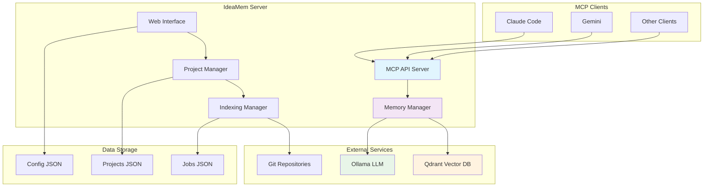
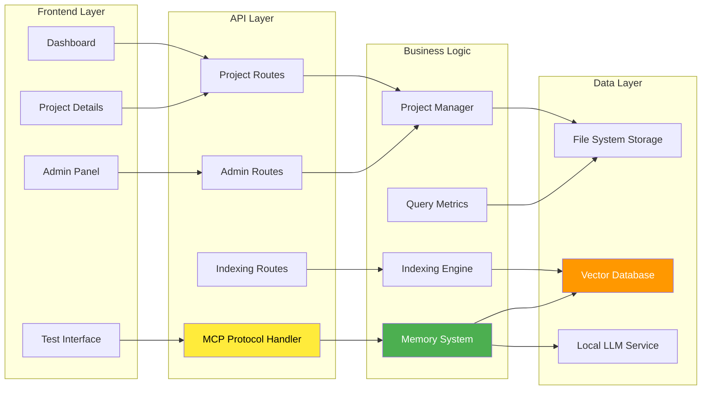
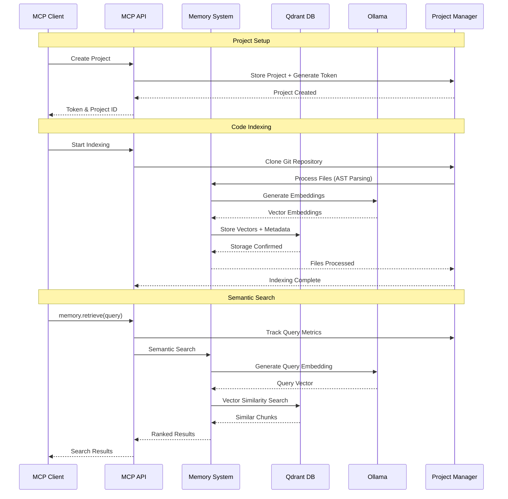

# IdeaMem - Semantic Memory MCP Server

A professional Model Context Protocol (MCP) server for semantic memory operations with intelligent code indexing, project isolation, and a modern web interface.

## 🚀 Features

### Core Functionality
- **Semantic Code Search** - AST-based chunking for JavaScript/TypeScript with intelligent parsing
- **Multi-format Support** - Code, documentation, configuration files, and more
- **Project Isolation** - Separate semantic memory spaces per project with token-based authentication
- **Background Indexing** - Git repository cloning with real-time progress tracking
- **Query Metrics** - Track and visualize MCP usage statistics
- **Professional Web UI** - Modern React dashboard with comprehensive project management

### MCP Protocol
- **JSON-RPC 2.0 Compliant** - Full MCP protocol implementation
- **Tool Discovery** - Automatic tool listing and capability negotiation
- **Error Handling** - Comprehensive error boundaries with proper status codes
- **Authentication** - Token-based per-project security

### Architecture
- **Vector Database** - Qdrant integration for semantic embeddings
- **Local LLM** - Ollama with `nomic-embed-text` model for embeddings
- **Project Management** - Multi-tenant isolation with comprehensive metrics
- **Real-time Updates** - Live indexing progress and status synchronization

## 📋 Table of Contents

- [Quick Start](#-quick-start)
- [Architecture](#-architecture)
- [API Documentation](#-api-documentation)
- [Web Interface](#-web-interface)
- [Configuration](#-configuration)
- [Development](#-development)
- [Deployment](#-deployment)
- [Troubleshooting](#-troubleshooting)

## 🎯 Quick Start

### Prerequisites

1. **Qdrant Vector Database**
   ```bash
   docker run -p 6333:6333 qdrant/qdrant
   ```

2. **Ollama with embedding model**
   ```bash
   # Install Ollama
   curl -fsSL https://ollama.ai/install.sh | sh
   
   # Pull the embedding model
   ollama pull nomic-embed-text
   ```

### Installation

1. **Clone the repository**
   ```bash
   git clone https://github.com/your-username/ideamem.git
   cd ideamem
   ```

2. **Install dependencies**
   ```bash
   pnpm install
   ```

3. **Start the development server**
   ```bash
   pnpm dev
   ```

4. **Configure services**
   - Open http://localhost:3000/admin
   - Verify Qdrant and Ollama connections
   - Pull the `nomic-embed-text` model if needed

### Create Your First Project

1. Go to http://localhost:3000/dashboard
2. Click "New Project"
3. Enter project details and Git repository URL
4. Click "Create Project"
5. Click "Index" to start code indexing
6. Use "Connect" to get MCP connection commands

### Connect to Claude Code

```bash
claude mcp add --transport http ideamem-project-name http://localhost:3000/api/mcp --header "Authorization: Bearer YOUR_TOKEN" --header "X-Project-ID: PROJECT_ID"
```

## 🏗️ Architecture

### System Overview



### Component Architecture



### Data Flow



### File Structure

```
ideamem/
├── app/                          # Next.js App Router
│   ├── admin/                    # Admin panel
│   ├── api/                      # API routes
│   │   ├── admin/               # Admin endpoints
│   │   ├── mcp/                 # MCP protocol handler
│   │   └── projects/            # Project management
│   ├── dashboard/               # Main dashboard
│   ├── projects/[id]/          # Project detail pages
│   └── test-mcp/               # MCP testing interface
├── lib/                         # Business logic
│   ├── config.ts               # Configuration management
│   ├── indexing.ts             # Background indexing
│   ├── memory.ts               # Semantic memory operations
│   └── projects.ts             # Project management
├── data/                        # Runtime data (gitignored)
│   ├── projects.json           # Project storage
│   ├── indexing-jobs.json      # Job tracking
│   └── config.json             # Service configuration
└── docs/                        # Documentation
    └── architecture.md          # Detailed architecture docs
```

## 📚 API Documentation

### MCP Protocol Endpoints

#### POST /api/mcp

The main MCP protocol endpoint supporting JSON-RPC 2.0.

**Headers:**
- `Authorization: Bearer <token>` - Project authentication token
- `X-Project-ID: <project-id>` - Project identifier
- `Content-Type: application/json`

**Supported Methods:**

##### `initialize`
Initialize MCP connection and negotiate capabilities.

```json
{
  "jsonrpc": "2.0",
  "method": "initialize",
  "params": {
    "protocolVersion": "2024-11-05"
  },
  "id": 1
}
```

##### `tools/list`
List available memory tools.

```json
{
  "jsonrpc": "2.0",
  "method": "tools/list",
  "id": 2
}
```

##### `tools/call` - memory.ingest
Store and index content in semantic memory.

```json
{
  "jsonrpc": "2.0",
  "method": "tools/call",
  "params": {
    "name": "memory.ingest",
    "arguments": {
      "content": "function hello() { console.log('world'); }",
      "source": "src/hello.js",
      "type": "code",
      "language": "javascript",
      "project_id": "my-project",
      "scope": "project"
    }
  },
  "id": 3
}
```

##### `tools/call` - memory.retrieve
Perform semantic search across indexed content.

```json
{
  "jsonrpc": "2.0",
  "method": "tools/call",
  "params": {
    "name": "memory.retrieve",
    "arguments": {
      "query": "authentication functions",
      "project_id": "my-project",
      "scope": "project",
      "filters": {
        "type": "code",
        "language": "typescript"
      }
    }
  },
  "id": 4
}
```

##### `tools/call` - memory.delete_source
Delete all content from a specific source.

```json
{
  "jsonrpc": "2.0",
  "method": "tools/call",
  "params": {
    "name": "memory.delete_source",
    "arguments": {
      "source": "src/old-file.js",
      "project_id": "my-project",
      "scope": "project"
    }
  },
  "id": 5
}
```

##### `tools/call` - memory.list_projects
List all available project identifiers.

```json
{
  "jsonrpc": "2.0",
  "method": "tools/call",
  "params": {
    "name": "memory.list_projects",
    "arguments": {}
  },
  "id": 6
}
```

### Web API Endpoints

#### Projects
- `GET /api/projects` - List all projects
- `POST /api/projects` - Create new project
- `GET /api/projects/[id]` - Get project details
- `DELETE /api/projects/[id]` - Delete project
- `POST /api/projects/[id]/token` - Regenerate token
- `POST /api/projects/[id]/index` - Start indexing
- `DELETE /api/projects/[id]/index` - Stop indexing

#### Admin
- `GET/POST /api/admin/config` - Service configuration
- `POST /api/admin/health` - Health checks
- `POST /api/admin/pull-model` - Pull Ollama models

#### Indexing
- `GET /api/projects/indexing/status` - Get active indexing jobs

## 🖥️ Web Interface

### Dashboard (`/dashboard`)
- **Project Overview** - Grid view of all projects with status indicators
- **Quick Actions** - Start/stop indexing, view details
- **Status Monitoring** - Real-time indexing progress with file counts
- **Project Creation** - Modal form for new project setup

### Project Details (`/projects/[id]`)
- **Comprehensive Information** - Git repo, creation dates, indexing history
- **Token Management** - View, copy, and regenerate authentication tokens
- **MCP Connection Setup** - Generate connection commands for Claude Code and Gemini
- **Query Metrics** - Visual statistics showing usage patterns
- **Indexing Control** - Start, stop, monitor background indexing
- **File Statistics** - Detailed counts of indexed files and vectors

### Admin Panel (`/admin`)
- **Service Configuration** - Qdrant and Ollama connection settings
- **Health Monitoring** - Service status and connectivity checks
- **Model Management** - Pull and verify Ollama embedding models
- **System Status** - Overall system health dashboard

### Test Interface (`/test-mcp`)
- **Protocol Testing** - Interactive MCP protocol validation
- **Tool Execution** - Test memory operations directly
- **Debug Interface** - Raw JSON-RPC request/response viewer

## ⚙️ Configuration

### Service Configuration

The system uses `config.json` for service configuration:

```json
{
  "qdrantUrl": "http://localhost:6333",
  "ollamaUrl": "http://localhost:11434"
}
```

Configuration can be updated via:
1. Admin web interface (`/admin`)
2. Direct API calls to `/api/admin/config`
3. Manual `config.json` editing (requires restart)

### Environment Variables

```bash
# Optional: Override default ports
PORT=3000
QDRANT_URL=http://localhost:6333
OLLAMA_URL=http://localhost:11434

# Optional: Data directory
DATA_DIR=./data
```

### Project Structure

Each project maintains:
- **Unique ID** - UUID-based project identifier
- **Authentication Token** - Secure access token (`idm_` prefixed)
- **Git Repository** - Source repository URL
- **Indexing Status** - Current processing state
- **Query Metrics** - Usage statistics and timestamps
- **Vector Storage** - Project-scoped semantic index

## 🔧 Development

### Tech Stack

- **Frontend**: Next.js 15, React 19, TypeScript, Tailwind CSS v3
- **Backend**: Next.js API Routes, Node.js
- **Database**: Qdrant (vectors), JSON files (metadata)
- **AI/ML**: Ollama (`nomic-embed-text`)
- **UI Components**: Headless UI, Heroicons
- **Build Tools**: pnpm, TypeScript compiler

### Development Commands

```bash
# Install dependencies
pnpm install

# Development server
pnpm dev

# Type checking
pnpm tsc --noEmit --skipLibCheck

# Linting
pnpm lint

# Production build
pnpm build

# Production start
pnpm start
```

### Code Organization

- **Separation of Concerns** - Clear boundaries between UI, API, and business logic
- **Type Safety** - Comprehensive TypeScript coverage with strict mode
- **Error Handling** - Proper error boundaries and user feedback
- **Code Quality** - ESLint rules without disabled directives

### Testing Strategy

- **MCP Protocol** - Use `/test-mcp` interface for protocol validation
- **API Endpoints** - Manual testing via web interface
- **Indexing** - Monitor via dashboard with real-time progress
- **Memory Operations** - Test semantic search through MCP clients

## 🚀 Deployment

### Production Build

```bash
# Build for production
pnpm build

# Start production server
pnpm start
```

### Docker Deployment

```dockerfile
FROM node:18-alpine

WORKDIR /app
COPY package*.json ./
RUN npm ci --only=production

COPY . .
RUN npm run build

EXPOSE 3000
CMD ["npm", "start"]
```

### Service Dependencies

Ensure these services are running:

1. **Qdrant Vector Database**
   ```bash
   docker run -d -p 6333:6333 qdrant/qdrant
   ```

2. **Ollama with Models**
   ```bash
   ollama serve
   ollama pull nomic-embed-text
   ```

### Production Checklist

- [ ] Configure service URLs for production
- [ ] Set up proper authentication/authorization
- [ ] Configure persistent data storage
- [ ] Set up monitoring and logging
- [ ] Configure backup procedures
- [ ] Test MCP client connections
- [ ] Verify indexing performance
- [ ] Monitor query metrics

## 🔍 Troubleshooting

### Common Issues

#### Indexing Stuck in Progress
- **Symptom**: Status shows "Indexing" but progress bar disappears
- **Solution**: Fixed in latest version with smart status detection
- **Verification**: Check browser console for "Refreshing projects" logs

#### MCP Connection Fails
- **Symptom**: Claude Code reports connection errors
- **Solution**: Verify token format and headers
- **Command**: Use exact format from Connection Setup modal

#### Qdrant Connection Issues
- **Symptom**: "Failed to connect to Qdrant" in admin panel
- **Solution**: Verify Qdrant is running on correct port
- **Check**: `curl http://localhost:6333/collections`

#### Ollama Model Missing
- **Symptom**: "Model not found" errors during indexing
- **Solution**: Pull the embedding model
- **Command**: `ollama pull nomic-embed-text`

### Debug Tools

1. **Browser Console** - Check for client-side errors
2. **Network Tab** - Monitor API requests and responses
3. **Admin Panel** - Service health and connectivity
4. **Test Interface** - MCP protocol validation

### Performance Tips

- **Large Repositories**: Consider selective indexing
- **Query Performance**: Use specific filters for better results
- **Memory Usage**: Monitor Qdrant collection size
- **Network**: Ensure low latency to Qdrant and Ollama

## 📝 License

This project is licensed under the MIT License - see the [LICENSE](LICENSE) file for details.

## 🤝 Contributing

1. Fork the repository
2. Create your feature branch (`git checkout -b feature/amazing-feature`)
3. Commit your changes (`git commit -m 'Add some amazing feature'`)
4. Push to the branch (`git push origin feature/amazing-feature`)
5. Open a Pull Request

## 📞 Support

- **Issues**: [GitHub Issues](https://github.com/your-username/ideamem/issues)
- **Discussions**: [GitHub Discussions](https://github.com/your-username/ideamem/discussions)
- **Documentation**: [Wiki](https://github.com/your-username/ideamem/wiki)

---

Built with ❤️ using [Claude Code](https://claude.ai/code)