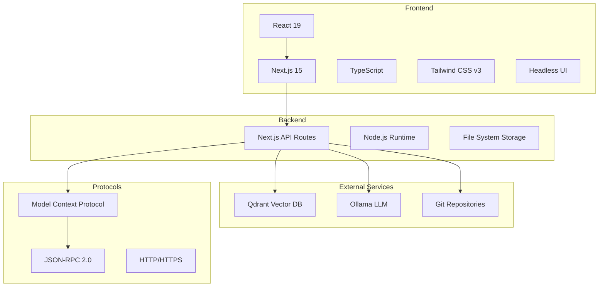
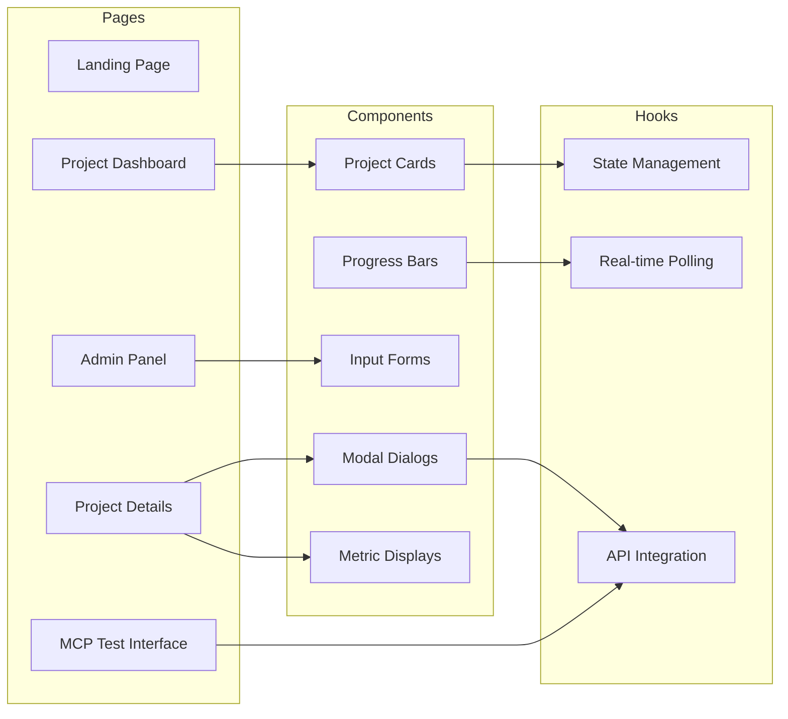
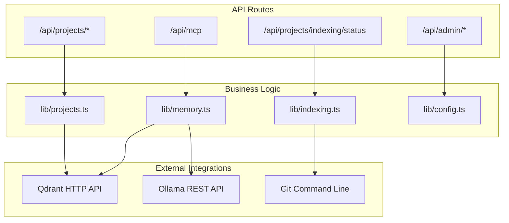
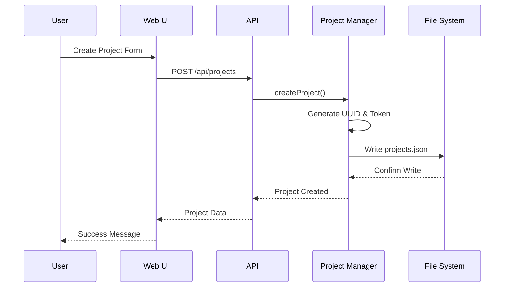
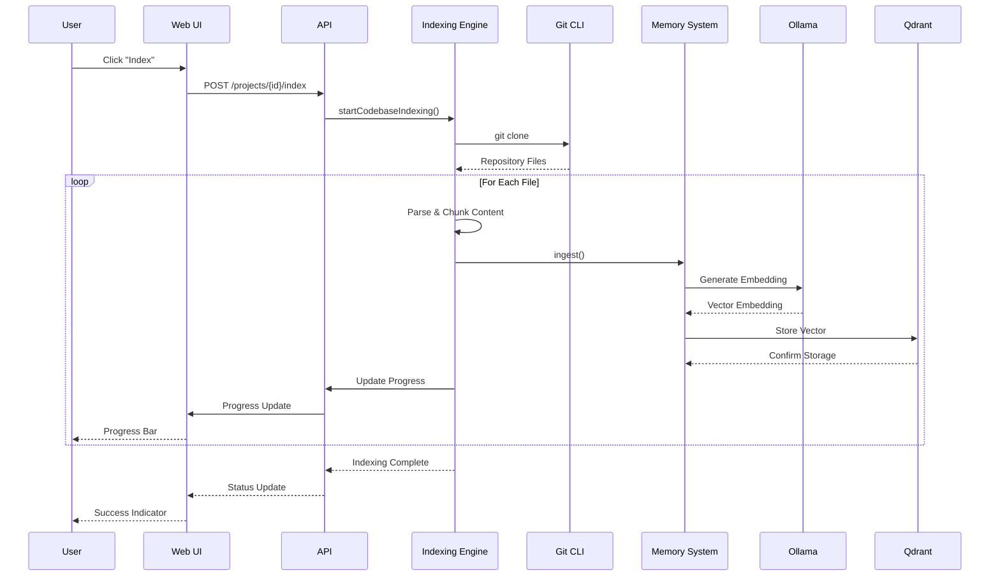
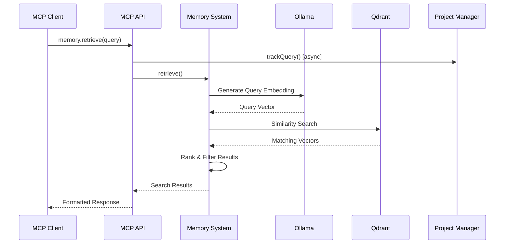

# IdeaMem: The Comprehensive Guide

This document provides a complete overview of the IdeaMem system, from high-level architecture to detailed API usage and deployment strategies.

## 🚀 Quick Start

### Prerequisites

1.  **Qdrant Vector Database**:
    ```bash
    docker run -p 6333:6333 qdrant/qdrant
    ```

2.  **Ollama with embedding model**:
    ```bash
    # Install Ollama
    curl -fsSL https://ollama.ai/install.sh | sh

    # Pull the embedding model
    ollama pull nomic-embed-text
    ```

### Installation

1.  **Clone the repository**:
    ```bash
    git clone https://github.com/your-username/ideamem.git
    cd ideamem
    ```

2.  **Install dependencies**:
    ```bash
    pnpm install
    ```

3.  **Start the development server**:
    ```bash
    pnpm dev
    ```

4.  **Configure services**:
    *   Open http://localhost:3000/admin
    *   Verify Qdrant and Ollama connections
    *   Pull the `nomic-embed-text` model if needed

### Create Your First Project

1.  Go to http://localhost:3000/dashboard
2.  Click "New Project"
3.  Enter project details and Git repository URL
4.  Click "Create Project"
5.  Click "Index" to start code indexing
6.  Use "Connect" to get MCP connection commands

### Connect to Claude Code

```bash
claude mcp add --transport http ideamem-project-name http://localhost:3000/api/mcp --header "Authorization: Bearer YOUR_TOKEN" --header "X-Project-ID: PROJECT_ID"
```

## 🏗️ Architecture

### System Overview

IdeaMem is a semantic memory system built on the Model Context Protocol (MCP), designed to provide intelligent code indexing and search capabilities with project isolation and comprehensive management tools.

#### Core Principles

1.  **Project Isolation** - Complete separation of data and operations between projects
2.  **Real-time Operations** - Live updates for indexing progress and status
3.  **Type Safety** - Comprehensive TypeScript coverage with strict mode
4.  **Error Resilience** - Graceful handling of failures with proper user feedback
5.  **Scalable Design** - Architecture that supports growth in projects and data

#### Technology Stack



### Component Architecture

#### Frontend Layer

The frontend is built as a single-page application with multiple views:



#### Backend Layer

The backend is structured around Next.js API routes with clear separation of concerns:



### Data Flow

#### Project Creation Flow



#### Code Indexing Flow



#### Semantic Search Flow



### Storage Systems

#### File-Based Storage

The system uses JSON files for metadata storage:

```
data/
├── projects.json
├── indexing-jobs.json
└── config.json
```

#### Vector Storage

Vectors are stored in Qdrant with project-based isolation.

### Security Model

*   **Token-Based Authentication**: Unique tokens per project.
*   **Project Isolation**: Data separation between projects.
*   **Authorization**: Token validates project access.

## 📚 API Documentation

### MCP Workflow

**MANDATORY FIRST STEP**: `codebase.check_constraints`

**BEFORE ANY CODE WRITING**:
*   `codebase.validate_symbol`
*   `codebase.validate_enum_values`
*   `codebase.check_function_signature`

### MCP Tools Reference

#### Core Codebase Tools
*   `codebase.check_constraints`
*   `codebase.set_constraints`
*   `codebase.search`
*   `codebase.store`
*   `codebase.forget`

#### File Management Tools
*   `codebase.index_file`
*   `codebase.refresh_file`
*   `codebase.rebuild_all`
*   `codebase.sync_changes`
*   `codebase.cleanup_project`

#### Code Validation Tools
*   `codebase.validate_symbol`
*   `codebase.validate_enum_values`
*   `codebase.check_function_signature`
*   `codebase.check_interface_changes`
*   `codebase.find_usage_patterns`

#### Documentation Tools
*   `docs.list_repositories`
*   `docs.add_repository`
*   `docs.index_repository`
*   `docs.search`
*   `docs.hybrid_search`
*   `docs.search_suggestions`
*   `docs.relationship_graph`
*   `docs.find_related`
*   `docs.faceted_search`

### API Endpoints

*   `POST /api/mcp`: Main MCP protocol endpoint.
*   `GET/POST /api/projects`: List/Create projects.
*   And many more for admin, indexing, webhooks, etc.

### Middleware and Validation

The API uses a robust middleware system for CORS, rate limiting, security headers, compression, and validation with Zod.

## 🖥️ Web Interface

*   **/dashboard**: Project overview and management.
*   **/projects/[id]**: Detailed project information and controls.
*   **/admin**: Service configuration and health monitoring.
*   **/test-mcp**: Interactive MCP testing interface.

## ⚙️ Configuration

### Service Configuration

Managed via `config.json` or the admin interface.

```json
{
  "qdrantUrl": "http://localhost:6333",
  "ollamaUrl": "http://localhost:11434"
}
```

### Environment Variables

```bash
# Optional: Override default ports and URLs
PORT=3000
QDRANT_URL=http://localhost:6333
OLLAMA_URL=http://localhost:11434
DATA_DIR=./data

# Logging Configuration
LOG_LEVEL=debug
LOG_DIR=./logs
SERVICE_NAME=ideamem-api
SERVICE_VERSION=1.0.0
HOSTNAME=localhost
NODE_ENV=development
```

## 🔧 Development

### Tech Stack

*   **Frontend**: Next.js 15, React 19, TypeScript, Tailwind CSS v3
*   **Backend**: Next.js API Routes, Node.js
*   **Database**: Qdrant (vectors), JSON files (metadata)
*   **AI/ML**: Ollama (`nomic-embed-text`)

### Development Commands

```bash
pnpm install
pnpm dev
pnpm lint
pnpm tsc --noEmit --skipLibCheck
pnpm build
pnpm start
```

## 🚀 Deployment

Refer to the detailed [Deployment Guide](#-deployment-guide) section for production, Docker, and cloud deployment strategies.

## 🪵 Logging

IdeaMem uses Winston for structured logging. See the [Winston Logging Guide](#-winston-logging-guide) for details on configuration and usage.

## 🔌 Shutdown Manager

A centralized shutdown manager (`lib/shutdown-manager.ts`) handles graceful shutdown of services, preventing memory leaks and ensuring proper shutdown order.

## 🔄 Refactoring and Sprint Summaries

This project has undergone significant refactoring to improve code quality, reduce duplication, and implement unified patterns. Detailed summaries of these efforts are available in `REFACTORING_SUMMARY.md` and `SPRINT_3_SUMMARY.md`.

## 🔍 Troubleshooting

*   **Indexing Stuck**: Check the browser console for errors.
*   **MCP Connection Fails**: Verify token and headers.
*   **Qdrant/Ollama Issues**: Use the admin panel to check service health.

---

This guide provides a high-level overview. For more details, please refer to the specific documentation files that were consolidated to create this guide.
