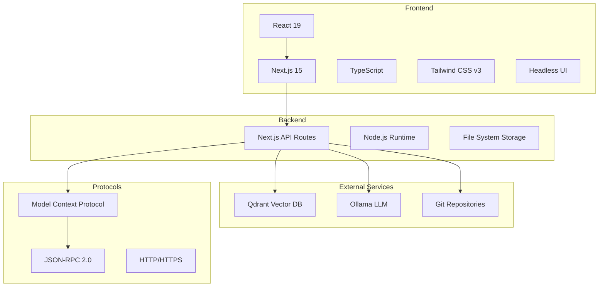
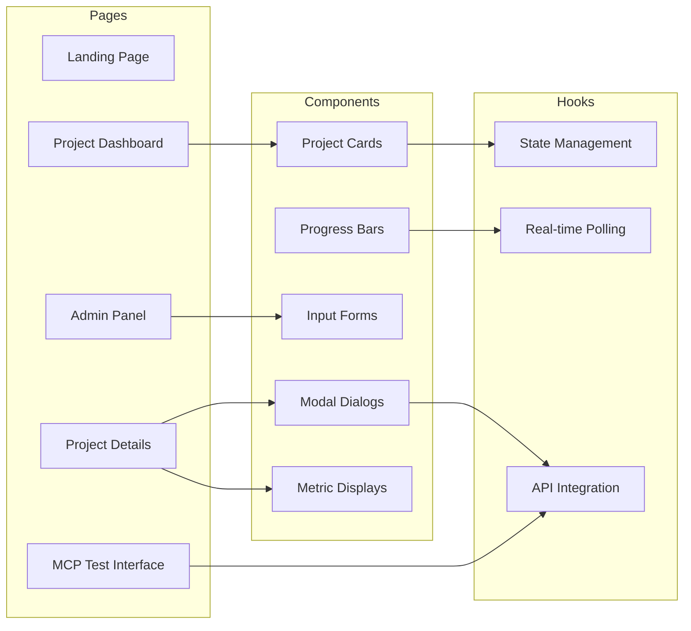
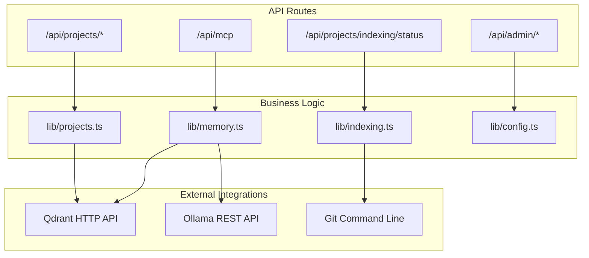
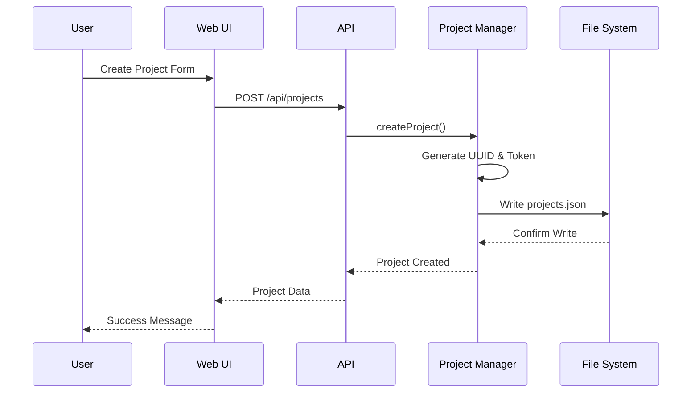
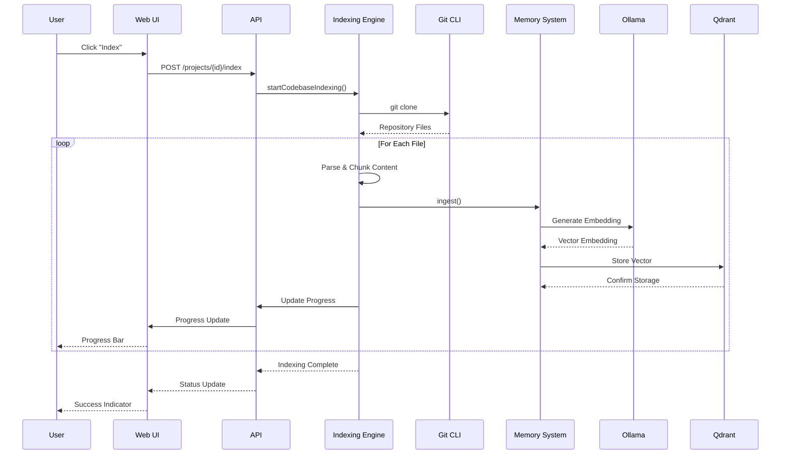
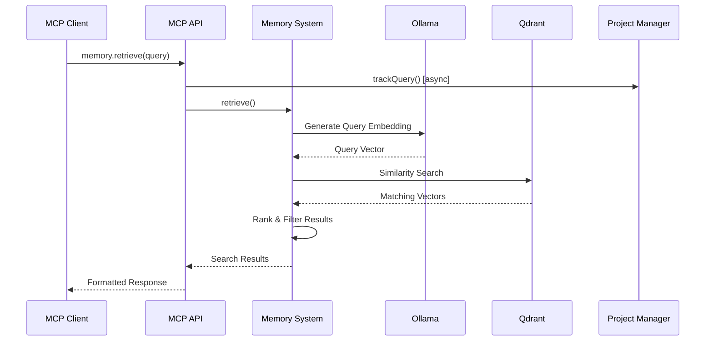
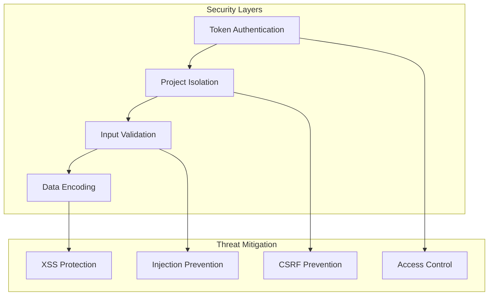
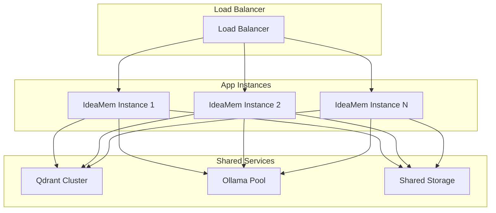
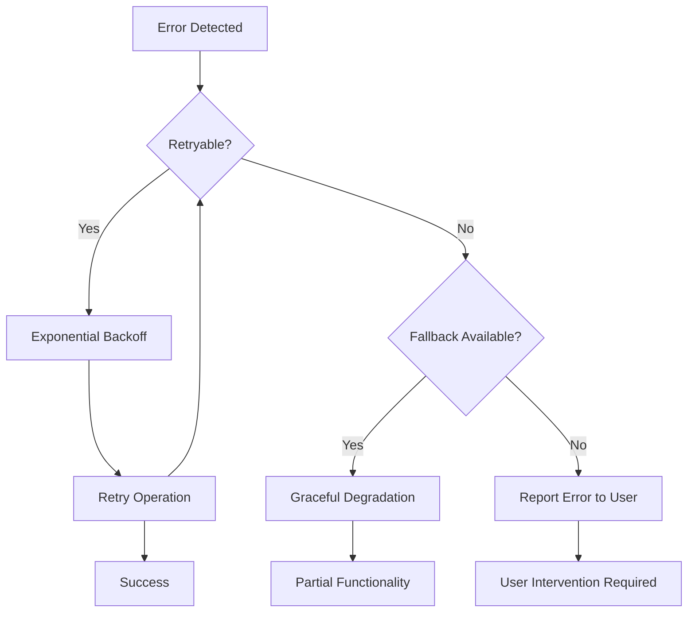

# IdeaMem Architecture Documentation

This document provides a detailed technical overview of the IdeaMem system architecture, design decisions, and implementation details.

## Table of Contents

- [System Overview](#system-overview)
- [Component Architecture](#component-architecture)
- [Data Flow](#data-flow)
- [Storage Systems](#storage-systems)
- [Security Model](#security-model)
- [Performance Considerations](#performance-considerations)
- [Scalability Design](#scalability-design)
- [Error Handling](#error-handling)
- [Monitoring and Observability](#monitoring-and-observability)

## System Overview

IdeaMem is a semantic memory system built on the Model Context Protocol (MCP), designed to provide intelligent code indexing and search capabilities with project isolation and comprehensive management tools.

### Core Principles

1. **Project Isolation** - Complete separation of data and operations between projects
2. **Real-time Operations** - Live updates for indexing progress and status
3. **Type Safety** - Comprehensive TypeScript coverage with strict mode
4. **Error Resilience** - Graceful handling of failures with proper user feedback
5. **Scalable Design** - Architecture that supports growth in projects and data

### Technology Stack



## Component Architecture

### Frontend Layer

The frontend is built as a single-page application with multiple views:



#### Key Components

1. **Project Dashboard** (`/dashboard`)
   - Grid-based project overview
   - Real-time status indicators
   - Quick action buttons
   - Create project modal

2. **Project Details** (`/projects/[id]`)
   - Comprehensive project information
   - Token management interface
   - MCP connection setup
   - Query metrics visualization
   - Indexing control panel

3. **Admin Panel** (`/admin`)
   - Service configuration management
   - Health monitoring dashboard
   - Model management interface

### Backend Layer

The backend is structured around Next.js API routes with clear separation of concerns:



#### Key Modules

1. **MCP Protocol Handler** (`app/api/mcp/route.ts`)
   - JSON-RPC 2.0 compliance
   - Authentication and authorization
   - Tool discovery and execution
   - Error handling and responses

2. **Project Management** (`lib/projects.ts`)
   - CRUD operations for projects
   - Token generation and validation
   - Query metrics tracking
   - Indexing job management

3. **Memory System** (`lib/memory.ts`)
   - Vector embedding operations
   - Semantic search capabilities
   - Content chunking and parsing
   - Qdrant integration

4. **Indexing Engine** (`lib/indexing.ts`)
   - Git repository cloning
   - File system traversal
   - AST-based code parsing
   - Background job processing

## Data Flow

### Project Creation Flow



### Code Indexing Flow



### Semantic Search Flow



## Storage Systems

### File-Based Storage

The system uses JSON files for metadata storage, providing simplicity and transparency:

```
data/
├── projects.json          # Project metadata and configuration
├── indexing-jobs.json     # Background job tracking
└── config.json           # Service configuration
```

#### Project Data Structure

```typescript
interface Project {
  id: string; // UUID
  name: string; // Display name
  description?: string; // Optional description
  gitRepo: string; // Repository URL
  token: string; // Authentication token (idm_*)
  createdAt: string; // ISO timestamp
  updatedAt: string; // ISO timestamp
  indexedAt?: string; // Last successful index
  indexStatus: Status; // Current indexing state
  indexProgress?: number; // 0-100 completion
  fileCount?: number; // Indexed files count
  vectorCount?: number; // Vector embeddings count
  lastError?: string; // Last error message

  // Query metrics
  totalQueries?: number; // Lifetime query count
  lastQueryAt?: string; // Most recent query
  queriesThisWeek?: number; // 7-day rolling count
  queriesThisMonth?: number; // 30-day rolling count
}
```

#### Indexing Job Structure

```typescript
interface IndexingJob {
  projectId: string; // Project reference
  status: JobStatus; // Current job state
  progress: number; // 0-100 completion
  currentFile?: string; // Currently processing file
  totalFiles: number; // Total files to process
  processedFiles: number; // Files completed
  vectorCount?: number; // Vectors created
  startTime: string; // Job start timestamp
  endTime?: string; // Job completion timestamp
  error?: string; // Error message if failed
}
```

### Vector Storage

Vectors are stored in Qdrant with project-based isolation:

```typescript
interface VectorPayload {
  content: string; // Original text content
  source: string; // File path or identifier
  type: ContentType; // Content classification
  language: string; // Programming language
  project_id: string; // Project isolation
  scope: 'project' | 'global'; // Access scope
  chunk_index?: number; // Chunk sequence number
  metadata?: Record<string, any>; // Additional metadata
}
```

## Security Model

### Authentication

1. **Token-Based Authentication**
   - Each project has a unique token (`idm_` prefix)
   - Tokens are cryptographically secure UUIDs
   - Bearer token authentication for MCP clients

2. **Project Isolation**
   - Complete data separation between projects
   - Vector queries filtered by project_id
   - No cross-project data leakage

3. **Authorization**
   - Token validates project access
   - Project ID header ensures proper isolation
   - Admin operations require local access

### Data Protection



## Performance Considerations

### Indexing Performance

1. **Chunking Strategy**
   - AST-based parsing for code files
   - Semantic boundary detection
   - Optimal chunk size for embeddings

2. **Background Processing**
   - Non-blocking indexing operations
   - Progress tracking and cancellation
   - Resource management

3. **Vector Operations**
   - Batch embedding generation
   - Efficient similarity search
   - Result ranking and filtering

### Query Performance

1. **Embedding Cache**
   - Query embedding reuse
   - Common query optimization
   - Response caching strategies

2. **Search Optimization**
   - Project-scoped searches
   - Filter-first approach
   - Similarity threshold tuning

### Frontend Performance

1. **Real-time Updates**
   - Efficient polling strategies
   - Conditional rendering
   - State synchronization

2. **UI Responsiveness**
   - Progressive loading
   - Optimistic updates
   - Error boundaries

## Scalability Design

### Horizontal Scaling



### Vertical Scaling

1. **Resource Allocation**
   - Memory for vector operations
   - CPU for embedding generation
   - Storage for vector data

2. **Optimization Points**
   - Qdrant configuration tuning
   - Ollama model optimization
   - Node.js runtime tuning

## Error Handling

### Error Categories

1. **System Errors**
   - Service unavailable
   - Network connectivity
   - Resource exhaustion

2. **User Errors**
   - Invalid input
   - Authentication failures
   - Permission denied

3. **Business Logic Errors**
   - Project not found
   - Indexing conflicts
   - Query failures

### Error Response Format

```typescript
interface ErrorResponse {
  jsonrpc: '2.0';
  error: {
    code: number; // JSON-RPC error code
    message: string; // Human-readable message
    data?: any; // Additional error context
  };
  id: string | number | null; // Request ID
}
```

### Recovery Strategies



## Monitoring and Observability

### Metrics Collection

1. **System Metrics**
   - Request latency
   - Error rates
   - Resource utilization

2. **Business Metrics**
   - Project creation rate
   - Indexing success rate
   - Query volume and performance

3. **User Metrics**
   - Active projects
   - Query patterns
   - Feature usage

### Logging Strategy

```typescript
interface LogEntry {
  timestamp: string; // ISO timestamp
  level: LogLevel; // ERROR, WARN, INFO, DEBUG
  component: string; // System component
  message: string; // Log message
  context?: Record<string, any>; // Additional context
  requestId?: string; // Request correlation
  userId?: string; // User context
  projectId?: string; // Project context
}
```

### Health Checks

1. **Service Health**
   - Qdrant connectivity
   - Ollama model availability
   - File system access

2. **Application Health**
   - API responsiveness
   - Background job status
   - Memory usage

3. **End-to-End Health**
   - Complete indexing workflow
   - Full query pipeline
   - User interface functionality

---

This architecture provides a solid foundation for a scalable, maintainable semantic memory system while maintaining simplicity and transparency in its design and implementation.
